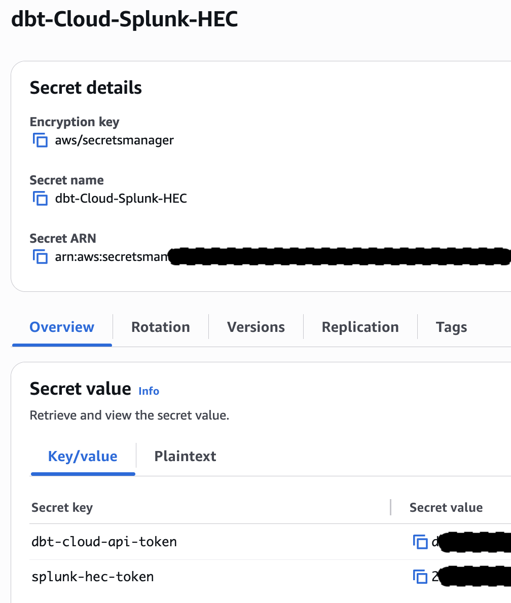
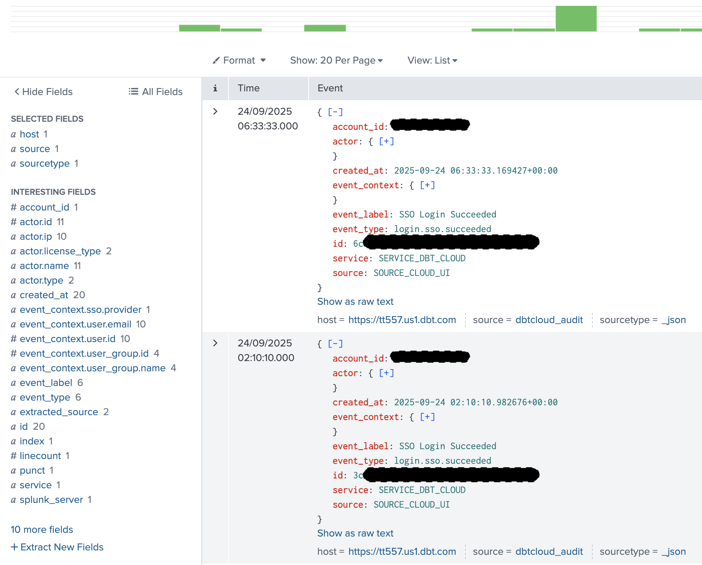

# dbtcloud_audit_lambda.py

This script is designed to fetch audit logs from dbt Cloud and send them to Splunk via the HTTP Event Collector (HEC). It is intended to be run as an AWS Lambda function, but can be adapted for other environments.

**NOTE:** This Lambda function must be given permission to read secrets from AWS Secrets Manager. See https://docs.aws.amazon.com/lambda/latest/dg/with-secrets-manager.html for more information.

The Lambda function must be configured to run on a schedule.

Before using, you must set the following configuration variables below:
  - `DBT_CLOUD_BASE_URL`: The base URL for your dbt Cloud instance (see docs).
  - `ACCOUNT_ID`: Your dbt Cloud account ID.
  - `SPLUNK_HEC_URL`: The full URL for your Splunk HEC endpoint.
  - `SECRET_NAME`: The name of the AWS Secrets Manager secret containing your dbt Cloud API token and Splunk HEC token. The secret name is looks for by default is "dbt-Cloud-Splunk-HEC", with key-value pairs for dbt-cloud-api-token and splunk-hec-token.
  - `REGION_NAME`: The AWS region where your secret is stored.
  - `MINUTES_LOOKBACK`: How far back to look for audit logs (in minutes).

See the dbt Cloud and Splunk documentation for more details on obtaining these values.

---

# Example AWS Key Manager Config

# Logs in Splunk

